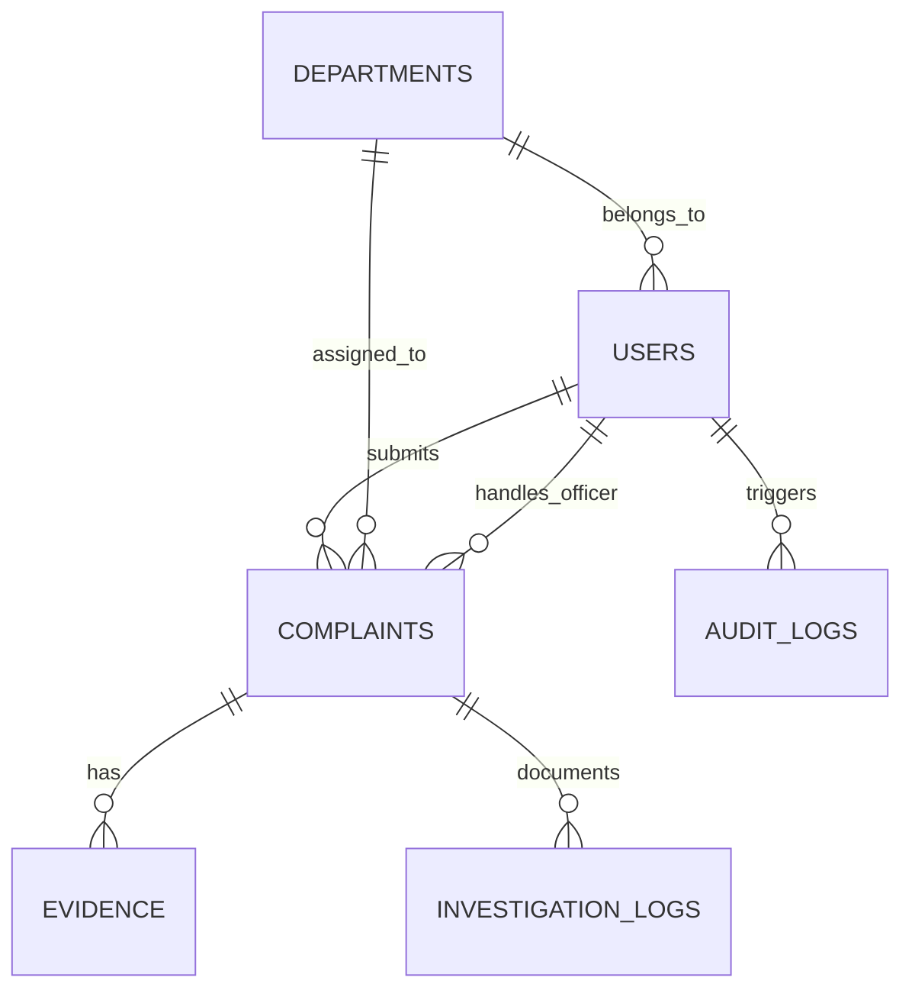

# Database Schema Specification
## Oromia Science and Technology Authority Complaint Management System

This document specifies the relational database schema design. The application utilizes **Sequelize ORM** targeting an underlying relational database engine. By default, **SQLite** is configured for development, and the schema is 100% compatible with **PostgreSQL** and **MySQL** for staging/production deployments.

---

---

## 1. Table Definitions

### 1.1 `Users` Table
Stores authentication and profile information for all users (citizens, staff, officers, department heads, and administrators).

| Column Name | Data Type | Constraints | Description |
| :--- | :--- | :--- | :--- |
| `id` | UUID / INTEGER | Primary Key, Auto Increment | Unique identifier for the user. |
| `email` | VARCHAR(255) | Unique, Not Null | Account email used for login. |
| `password_hash` | VARCHAR(255) | Not Null | Bcrypt encrypted password hash. |
| `full_name` | VARCHAR(255) | Not Null | User's full name. |
| `role` | ENUM | Not Null | One of: `citizen`, `staff`, `officer`, `dept_head`, `admin`. |
| `employee_id` | VARCHAR(50) | Nullable, Unique | Identification code for internal personnel. |
| `department_id` | INTEGER | Nullable, Foreign Key | Refers to `Departments(id)`. |
| `gender` | VARCHAR(10) | Not Null | Gender of the user (Male/Female). |
| `phone` | VARCHAR(20) | Unique, Not Null | Contact phone number. |
| `region` | VARCHAR(100) | Not Null | Region of residence/work. |
| `city` | VARCHAR(100) | Not Null | Zone or City. |
| `woreda` | VARCHAR(100) | Not Null | Sub-district/Woreda. |
| `kebele` | VARCHAR(100) | Not Null | Local neighborhood/Kebele. |
| `status` | VARCHAR(20) | Default: `'active'` | Account status: `'active'`, `'suspended'`, `'locked'`. |
| `failed_attempts` | INTEGER | Default: `0` | Consecutive failed login count. |
| `locked_until` | TIMESTAMP | Nullable | Expiration time of a security login lock. |
| `created_at` | TIMESTAMP | Not Null, Default: Current | Timestamp of user creation. |
| `updated_at` | TIMESTAMP | Not Null, Default: Current | Timestamp of last user update. |

---

### 1.2 `Departments` Table
Defines the organizational structure and geographical jurisdictions of the bureau.

| Column Name | Data Type | Constraints | Description |
| :--- | :--- | :--- | :--- |
| `id` | INTEGER | Primary Key, Auto Increment | Unique identifier for the department. |
| `name` | VARCHAR(255) | Not Null, Unique | Name of the department/directorate. |
| `description` | TEXT | Nullable | Detailed description of department duties. |
| `manager_id` | INTEGER | Nullable, Foreign Key | References `Users(id)` (Department Head). |
| `region` | VARCHAR(100) | Not Null | Regional jurisdiction of this branch. |
| `created_at` | TIMESTAMP | Not Null, Default: Current | Timestamp of creation. |

---

### 1.3 `Complaints` Table
Stores complaint records, current workflows, priority levels, and final decisions.

| Column Name | Data Type | Constraints | Description |
| :--- | :--- | :--- | :--- |
| `id` | INTEGER | Primary Key, Auto Increment | Unique identifier for the complaint. |
| `tracking_number` | VARCHAR(50) | Not Null, Unique | Sequential reference code (e.g. `CMS-2026-00042`). |
| `complainant_id` | INTEGER | Not Null, Foreign Key | References `Users(id)` (Citizen or Staff). |
| `type` | VARCHAR(20) | Not Null | Scope indicator: `'external'` (citizen) or `'internal'` (staff). |
| `category` | VARCHAR(50) | Not Null | E.g. `'environmental'`, `'service_delivery'`, `'administrative'`, `'personal'`, `'workplace'`, `'operational'`. |
| `description` | TEXT | Not Null | Detailed text description of the grievance. |
| `date_of_occurrence` | DATE | Not Null | Date when the issue occurred. |
| `location_address` | VARCHAR(255) | Not Null | Street address or locality. |
| `gps_coordinates` | VARCHAR(100) | Nullable | Geolocation coordinates (latitude, longitude). |
| `priority` | VARCHAR(20) | Default: `'medium'` | One of: `'low'`, `'medium'`, `'high'`, `'urgent'`. |
| `confidentiality` | VARCHAR(20) | Default: `'public'` | One of: `'public'` (visible after resolution) or `'confidential'`. |
| `status` | VARCHAR(20) | Default: `'submitted'` | One of: `'submitted'`, `'under_review'`, `'assigned'`, `'in_progress'`, `'pending_approval'`, `'resolved'`, `'rejected'`, `'appealed'`, `'closed'`. |
| `assigned_department_id` | INTEGER | Nullable, Foreign Key | References `Departments(id)`. |
| `assigned_officer_id` | INTEGER | Nullable, Foreign Key | References `Users(id)` (Complaint Officer). |
| `resolution_summary` | TEXT | Nullable | Final decision description written by officer. |
| `actions_taken` | TEXT | Nullable | Concrete administrative actions performed. |
| `resolution_letter_path` | VARCHAR(255) | Nullable | Path to the signed uploaded resolution letter. |
| `appeal_reason` | TEXT | Nullable | Complainant's reason for appeal. |
| `created_at` | TIMESTAMP | Not Null, Default: Current | Timestamp of submission. |
| `updated_at` | TIMESTAMP | Not Null, Default: Current | Timestamp of last status change. |

---

### 1.4 `Evidence` Table
Maintains links to uploaded documents, photos, audio files, or video evidence.

| Column Name | Data Type | Constraints | Description |
| :--- | :--- | :--- | :--- |
| `id` | INTEGER | Primary Key, Auto Increment | Unique identifier for evidence. |
| `complaint_id` | INTEGER | Not Null, Foreign Key | References `Complaints(id)`. |
| `uploader_id` | INTEGER | Not Null, Foreign Key | References `Users(id)`. |
| `file_name` | VARCHAR(255) | Not Null | Original name of the uploaded file. |
| `file_path` | VARCHAR(255) | Not Null | Path to file stored in the filesystem. |
| `file_size` | INTEGER | Not Null | File size in bytes. |
| `file_type` | VARCHAR(100) | Not Null | Mime type (e.g. `application/pdf`, `image/jpeg`). |
| `category` | VARCHAR(20) | Default: `'complainant'` | Scope: `'complainant'` or `'investigation'`. |
| `created_at` | TIMESTAMP | Not Null, Default: Current | Upload timestamp. |

---

### 1.5 `InvestigationLogs` Table
Stores chronological milestones and progress updates documented by investigating officers.

| Column Name | Data Type | Constraints | Description |
| :--- | :--- | :--- | :--- |
| `id` | INTEGER | Primary Key, Auto Increment | Unique identifier. |
| `complaint_id` | INTEGER | Not Null, Foreign Key | References `Complaints(id)`. |
| `officer_id` | INTEGER | Not Null, Foreign Key | References `Users(id)`. |
| `activity_description` | TEXT | Not Null | Details of investigation step taken. |
| `findings` | TEXT | Nullable | Findings, notes, or statements. |
| `created_at` | TIMESTAMP | Not Null, Default: Current | Date and time log was added. |

---

### 1.6 `AuditLogs` Table
Maintains comprehensive, immutable security history of system actions and user logins.

| Column Name | Data Type | Constraints | Description |
| :--- | :--- | :--- | :--- |
| `id` | INTEGER | Primary Key, Auto Increment | Unique identifier for audit log. |
| `user_id` | INTEGER | Nullable, Foreign Key | References `Users(id)` (Null for guest operations). |
| `action` | VARCHAR(100) | Not Null | Action performed (e.g. `'LOGIN_SUCCESS'`, `'STATUS_CHANGE'`). |
| `target_id` | VARCHAR(100) | Nullable | Reference target (e.g. complaint ID). |
| `details` | TEXT | Not Null | Descriptive details of the action. |
| `ip_address` | VARCHAR(45) | Not Null | Client IP address. |
| `created_at` | TIMESTAMP | Not Null, Default: Current | Timestamp of event occurrence. |
